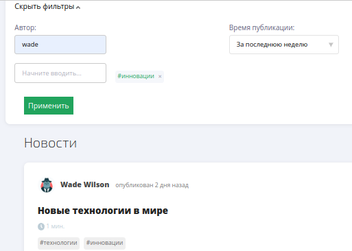

# Описание проекта

Данный файл предоставляет навигацию по классам, которые были мною реализованы в групповом проекте **"social-net-backend"**. Ниже приведены краткие описания выбранных классов и ссылки на соответствующие файлы с кодом.

## Communication-service

#### Вспомогательные классы:

[PostDto](./common/src/main/java/ru/team38/common/dto/post)

[LikeDto](./common/src/main/java/ru/team38/common/dto/like)

[PostMapper](./common/src/main/java/ru/team38/common/mappers/PostMapper.java)

[LikeMapper](./common/src/main/java/ru/team38/common/mappers/LikeMapper.java)

### Задача: Реализация новостной ленты

#### Используемые классы:

[PostController](./communications-service/src/main/java/ru/team38/communicationsservice/controllers/PostController.java)

[PostService](./communications-service/src/main/java/ru/team38/communicationsservice/services/PostService.java)

[PostRepository](./communications-service/src/main/java/ru/team38/communicationsservice/data/repositories/PostRepository.java)

[ConditionUtil](./communications-service/src/main/java/ru/team38/communicationsservice/services/utils/ConditionUtil.java)

[DtoAssembler](./communications-service/src/main/java/ru/team38/communicationsservice/services/utils/DtoAssembler.java)

**Описание:**

Была успешно реализована обширная система новостных лент, которая позволяет пользователям наслаждаться контентом в соответствии с их предпочтениями. Эта система охватывает следующие ключевые функции:

1. Общая новостная лента

Пользователям предоставлена возможность просматривать актуальные новости, включающие в себя как посты друзей, так и посты всех пользователей. Система поддерживает пагинацию, обеспечивая бесперебойное и удобное пролистывание большого объема контента.

2. Личная новостная лента

Для более индивидуального опыта пользователи могут выбирать между несколькими вариантами личных лент.

3. Поиск и фильтрация

Система обеспечивает гибкий поиск новостей:

- Поиск по **тексту**.
- Фильтрация по **тегам**.
- Поиск по **авторам**.
- Поиск по **дате публикации**.

4. Управление постами

- Создание новых постов.

- Редактирование содержания и заголовка.

- Удаление ненужных постов.

5. Планирование Постов

Реализована возможность **отложенных постов**, которая позволяет пользователям публиковать контент в назначенное время.

5. Работа с Тегами

Для организации контента реализован **ендпоинт для получения тегов** из базы данных, упрощая использование тегов в постах.

### Задача: Реализация лайков к постам и комментариям

#### Используемые классы:

[LikeController](./communications-service/src/main/java/ru/team38/communicationsservice/controllers/LikeController.java)

[LikeService](./communications-service/src/main/java/ru/team38/communicationsservice/services/LikeService.java)

[LikeRepository](./communications-service/src/main/java/ru/team38/communicationsservice/data/repositories/LikeRepository.java)

**Описание:**

В проекте успешно реализована возможность взаимодействия с контентом через реакции и лайки. Ниже представлен обзор ключевых возможностей этой части системы:

1. Реакции и Лайки

Пользователи имеют возможность:

- Ставить Лайки: К  комментариям.

- Проставлять Реакции: К постам. 

2. Уникальная Организация Реакций

При просмотре постов, пользователь видит в первую очередь реакцию автора поста, если она есть.

3. Замена Реакции

 Если пользователь меняет свою реакцию на другую, происходит замена реакции на новую.

4. Удаление Реакции

## User-service (common)

#### Вспомогательные классы:

[BirthdayMessage](./common/src/main/java/ru/team38/common/dto/notification/BirthdayMessage.java)

### Задача: Реализация уведомления о дне рождении

#### Используемые классы из Common:

[AccountCommonRepository](./common/src/main/java/ru/team38/common/repository/AccountCommonRepository.java)

**Методы:**  findAccountsByCurrentDate(), getZoneIdByCityAndCountry(String city, String country)

[NotificationAddService](./common/src/main/java/ru/team38/common/services/NotificationAddService.java)

**Методы:**  addNotificationBirthday(), isStartTimeByCityAndCountry(String city, String country)

**Описание:** 

Реализовано создание автоматических уведомлений о днях рождения пользователей. Данная функция охватывает следующие ключевые аспекты:

1. Автоматизированные Уведомления

Вне зависимости от текущей активности приложения, система активирует метод для создания уведомлений о днях рождения.

2. Гибкость Часового Пояса

Система с умом учитывает часовой пояс каждого пользователя. При поиске ближайших дней рождения она точно определяет временную зону, связанную с городом пользователя.

3. Создание Уведомлений

При обнаружении, что время относительно временной зоны пользователя находится в интервале от 00:00 до 00:59, система автоматически создает уведомление о дне рождения пользователя.

#### Используемые классы из User-service:

[LocationBasedUtilities](./user-service/src/main/java/ru/team38/userservice/services/task/LocationBasedUtilities.java)

[GeoRepository](./user-service/src/main/java/ru/team38/userservice/data/repositories/GeoRepository.java)

**Методы:** addZoneIdInCitiesTable(String city, String country), citiesRecordByCityAndCountry(String city, String country)

[AccountService](./user-service/src/main/java/ru/team38/userservice/services/AccountService.java)

**Метод:** updateAccount(AccountDto accountDto)

**Описание:** 

С использованием данных классов было реализовано добавление временной зоны пользователя при изменении или добавлении местоположения ползователя.

[NotificationService](./user-service/src/main/java/ru/team38/userservice/services/NotificationService.java)

**Методы:** getNotificationsPage(String lang, Integer size), getBirthdayMessageByLanguage(String languageCode)

**Описание:** 

В данном классе в методе getNotificationsPage(String lang, Integer size) была добавлена логика для уведомлений о дне рождении относительно выбранного языка на странице пользователя. 

   

Так же для реализации данной функции были внесены изменения во фронтенд:

1. Добавлен Header

2. Доработан следующий код

на

## Gateway-service

Gateway Service  является промежуточным компонентом в архитектуре микросервисов, который отвечает за обработку внешних запросов и направление их к соответствующим микросервисам. 

#### Используемые классы:

[CommunicationsServiceClient](./gateway-service/src/main/java/ru/team38/gatewayservice/clients/CommunicationsServiceClient.java)

[LikeController](./gateway-service/src/main/java/ru/team38/gatewayservice/controller/LikeController.java)

[PostController](./gateway-service/src/main/java/ru/team38/gatewayservice/controller/PostController.java)

[TagController](./gateway-service/src/main/java/ru/team38/gatewayservice/controller/TagController.java)

[LikeService](./gateway-service/src/main/java/ru/team38/gatewayservice/service/LikeService.java)

[PostService](./gateway-service/src/main/java/ru/team38/gatewayservice/service/PostService.java)

## db-management

### Задача: Реализация миграций 

[post](./db-management/src/main/resources/changelog/changelogs/changelog-1.0-post.xml)

[tag](./db-management/src/main/resources/changelog/changelogs/changelog-1.0-tag.xml)

[like](./db-management/src/main/resources/changelog/changelogs/changelog-1.0-like.xml)

## .localdev

### Задача: Реализация gitlab runner

[Инструкция по установке](./.localdev/README.md)

### Задача: Реализовать SQL Script с тестовыми данными 

[insertPost](./.localdev/testdata/insertPost.sql)

[insertTags](./.localdev/testdata/insert-tags.sql)
